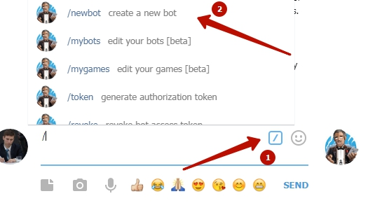
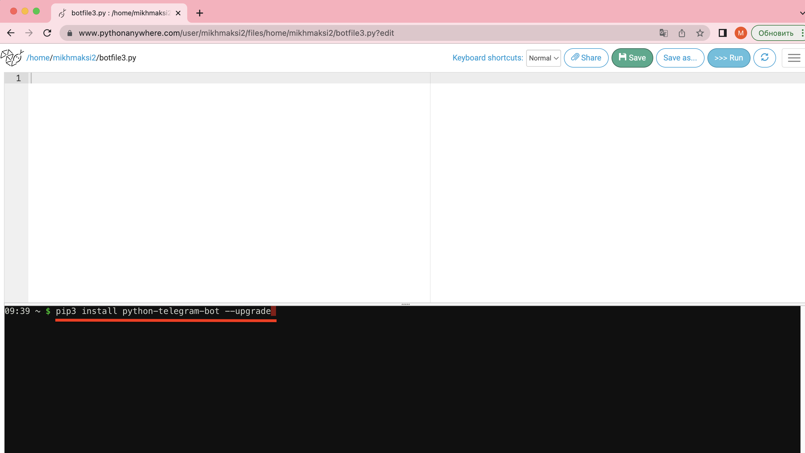
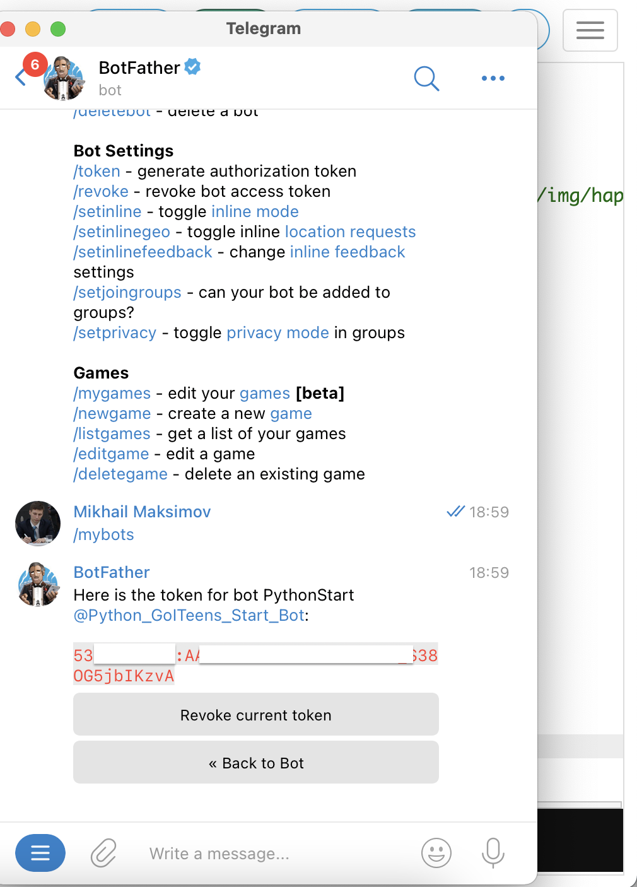

# Пробное занятие по Python
## Вступление
**Что такое Программирование?**  
Это сфера написания компьютерных программ.  
**Что такое компьютерные программы?**  
Это инструкции для компьютера, которые он умеет выполнять!

### Среда запуска. Первая программа.
**Понимает ли компьютер язык программирования на прямую?**  
Нет! Компьютер понимает исключительно машинный код. Машинный код - это набор 0 и 1.  
  
Чтобы перевести с языка программирования на "машинный" используется специальная программа-переводчик, которая называется `транслятор`. Для того, чтобы выполнить программу, написанную на `Python` необходим такой транслятор.  
Его можно установить на свой компьютер, но можно использовать и он-лайн версию таких программ. Для знакомства - нам будет достаточно использовать он-лайн транслятор [https://www.pythonanywhere.com/](https://www.pythonanywhere.com/).
  
Выбрать на главной странице создание кода  
  
Выбрать пакет "Начинающий"  
  
Зарегистрироваться  
  
Пропустить интерактивную инструкцию  
  
Перейти в раздел работы с файлами  
  
Создайте новый файл  


### Переменные в Python. Числа
Кроме строковых переменных в Python существуют и числовые:
```python
a = 2
b = 3
c = a + b
print(c)
```

### Ввод данных
Важной частью  любой программы является ввод данных.
```python
a = input("Введите число а")
b = input("Введите число b")
c = a + b
print(c) 
```
Если мы введем значение a = 2, значение b = 3 и попробуем сложить эти два числа, то получим 23. Так происходит из-за того, что наш транслятор введенные значения считает строками и применяет к ним операцию `+` как для строк. Т.е. объединяет две строки.  

Для того, чтобы получить сумму чисел 2 и 3 нам необходимо их преобразовать в числа после чтения. для этого применим команду `int()`, которая преобразует в число, если это возможно, строки которые находятся у неё в скобках.
```python
a = int(input("Введите число а"))
b = int(input("Введите число b"))
c = a + b
print(c) 
```
Теперь мы можем получить числа от пользователя, произвести с ними операции и вывести результат. Такие программы, в которых все инструкции выполняются одна за одной - называются линейными.

## Создание бота в Телеграмм
  

Обращаемся к "Отцу всех ботов" - боту `botfather`  

  

1. Выбираем меню команд.  
2. Выбираем команду "/newbot" (создать нового бота)  

  

1. Выбор команды
2. Выбор имени бота
3. Выбор пользовательского имени бота
4. Сохраните код доступа к боту

## Создание управляющей команды

Возвращаемся в исходное меню

  

Создаем новый файл

  

Заходим в консоль

  

Устанавливаем библиотеку python-telegram-bot (Нужен для работы с ботами)
pip3 install python-telegram-bot --upgrade
  

Библиотека python-telegram-bot - установлена


Добавляем код бота 
```python
from telegram.ext import Updater, MessageHandler, Filters

def echo(update, context):
    string_in = update.message.text
    string_out = string_in
    update.message.reply_text(string_out)

updater = Updater("")

dispatcher = updater.dispatcher

dispatcher.add_handler(MessageHandler(Filters.all, echo))

updater.start_polling()
updater.idle()
```
<a href = "https://github.com/mikh-maksi/python-probe/blob/master/bot/echo_bot.py">Ссылка на код эхо-бота</a>
<a href = "https://github.com/mikh-maksi/python-probe/blob/master/bot/lucky_bot.md">Ссылка на код счастливого бота</a>

  
  
И запускаем

  
  

Находим нашего бота по имени и подключаемся к нему.   
      
   
   
  
Пишем ему команду и получаем ответ.

У нас получился "эхо-бот" - т.е. бот, который повторяет то, что пишет пользователь.
Далее - мы напишем код, который позволяет сделать бота, который отвечает на определенные фразы, которые пишет пользователь.

## Счастливый бот
Поменяем функциальность нашему боту. Научим его теперь отправлять нам поздравительную открытку.
Для этого - удалим код эхо-бота


```python
from telegram import InlineKeyboardButton, InlineKeyboardMarkup
from telegram.ext import Updater, CommandHandler, CallbackQueryHandler

import random
# список картинок для випадкового вибоору однієї з них
img = ["https://mikh-maksi.github.io/probes/img/air.jpg", "https://mikh-maksi.github.io/probes/img/happy.jpg", "https://mikh-maksi.github.io/probes/img/happy2.jpg", "https://mikh-maksi.github.io/probes/img/flowers.jpg", "https://mikh-maksi.github.io/probes/img/morning.jpg"]

# кнопка із написом "Щаслива картинка"
keyboard = InlineKeyboardMarkup([[InlineKeyboardButton("Щаслива картка", callback_data="photo")]])

# обробка команди /start
def start(update, context):
    update.message.reply_text('Оберіть щастя:', reply_markup=keyboard)

# обробка нажаття на кнопку
def button(update, context):
    context.bot.send_photo(chat_id=update.effective_chat.id, photo=random.choice(img) ,reply_markup=keyboard)

# підключення до боту
updater = Updater("")

# обробка команди /start
updater.dispatcher.add_handler(CommandHandler('start', start))
# обробка нажаття кнопки
updater.dispatcher.add_handler(CallbackQueryHandler(button))

# команди запуску бота
updater.start_polling()
updater.idle()
```

При цьому - на 20-му рядку додамо токен підключення до боту  


Токен - візьмемо в боті **botfather**.  


Та запустимо отриманий код:  
  

Отримаємо відповідний результат:  
  

